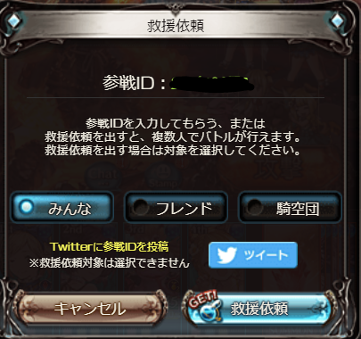

# グラブルの救援IDをOCRでとってくるやつ

## -\*-What is This?-\*-  

グランブルーファンタジーの救援IDを、光学画像認識(OCR)の技術を使ってコピーするアプリです。  
~~JSやF12でID抜くことを悪とする謎集団に対抗した~~  

## できること  

+ 下にあるような画面から、救援IDを読み取って、クリップボードにコピーすること
  
  

+ 読み取ったIDをアプリ上で修正してコピーし直すこと  

## TBD; 
+ 読み取ったIDを、自分のTwitterアカウントからtweetすること  

+ 読み取ったIDを、Google Spread Sheetの任意のセルに入力すること  

